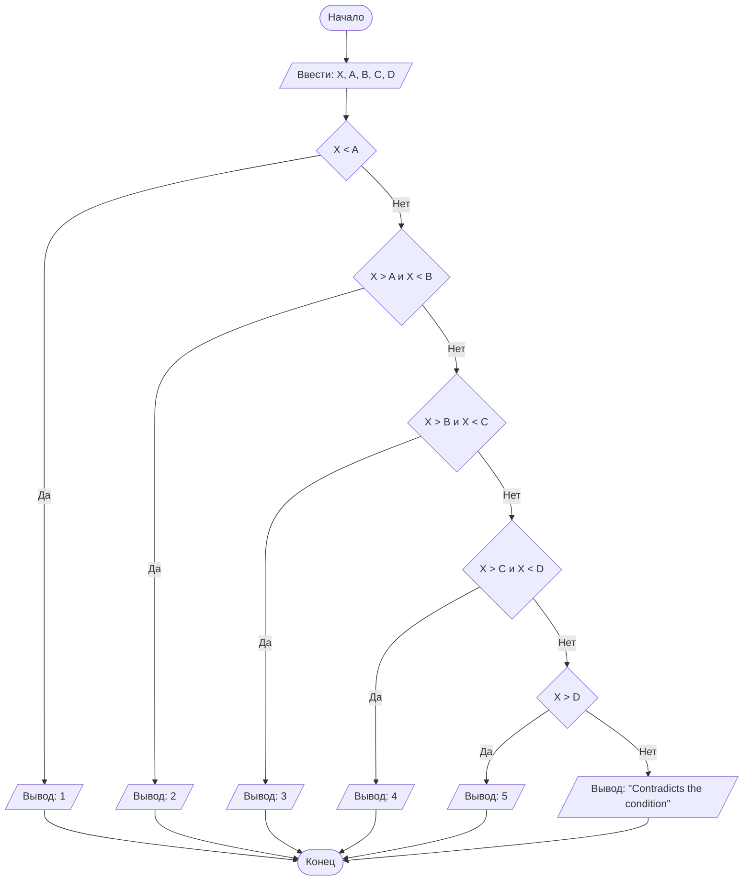

## Отчет по лабораторной работе № 1

#### № группы: `ПМ-2401`

#### Выполнил: `Овчинникова Анастасия Дмитриевна`

#### Вариант: `19`

### Cодержание:

- [Постановка задачи](#1-постановка-задачи)
- [Входные и выходные данные](#2-входные-и-выходные-данные)
- [Выбор структуры данных](#3-выбор-структуры-данных)
- [Алгоритм](#4-алгоритм)
- [Программа](#5-программа)
- [Анализ правильности решения](#6-анализ-правильности-решения)

### 1. Постановка задачи

> Программа получает на вход 5 целых чисел X,A,B,C,D. Числа A,B,C,D образуют участки на числовой прямой. 1 - (-inf;A), 2 - (A;B), 3 - (B;C), 4 - (C;D), 5 - (D;+inf); (inf - бесконечность).
> Нужно определить какому участку принадлежит X и вывести номер участка на экран.

### 2. Входные и выходные данные
#### Данные на вход
На вход программа должна получать 5 чисел, в условии сказано, что они являются целыми. Причем X не равен ни A, ни B, ни C, ни D.
#### Данные на выход
Программе необходимо вывести номер участка, следовательно это будет целое число, принадлежащее промежутку [1;5]. Если данные противоречат условию необходимо вывести "Contradicts the condition"

### 3. Выбор структуры данных

Программа получает 5 целых чисел. Поэтому для их хранения
можно выделить 5 переменных (`X`,`A`,`B`,`C`,`D`) типа `int` (integer).

|             | название переменной | Тип (в Java) | 
|-------------|---------------------|--------------|
| X (Число 1) | `X`                 | `int`        |
| A (Число 2) | `A`                 | `int`        |
| B (Число 3) | `B`                 | `int`        |
| C (Число 4) | `C`                 | `int`        |
| D (Число 5) | `D`                 | `int`        |

Для вывода результата необязательно его хранить в отдельной переменной.

### 4. Алгоритм

#### Алгоритм выполнения программы:

1. **Ввод данных:**  
   Программа считывает 5 целых чисел, обозначенные как `X`,`A`,`B`,`C`,`D`. 

2. **Сравнение чисел:**  
   1) Программа сравнивает `X` и `A`, если `X` меньше, то программа переходит к выводу (1 участок), если `A` меньше, то программа  переходит к следующему шагу - сравнению.
   2) Программа сравнивает `X` и `A` и `X` и `B`, т.к. `X` не должен быть равен `A` и `B`, если `X` строго больше `A` и строго меньше `B`, то программа переходит к выводу, если `X` больше или равен `B`, то программа переходит к следующему шагу - сравнению.
   3) Программа сравнивает `X` и `B` и `X` и `C`, т.к. `X` не должен быть равен `B` и `C`, если `X` строго больше `B` и строго меньше `C`, то программа переходит к выводу, если `X` больше или равен `C`, то программа переходит к следующему шагу - сравнению.
   4)  Программа сравнивает `X` и `C` и `X` и `D`, т.к. `X` не должен быть равен `C` и `D`, если `X` строго больше `C` и строго меньше `D`, то программа переходит к выводу, если `X` больше или равен `D`, то программа переходит к следующему шагу - сравнению.
   5)  Программа сравнивает `X` и `D`, если `X` строго больше `D`, то программа переходит к выводу, если нет, то значит, что `X` равен какому-то из чисел`A`,`B`,`C`,`D, тогда программа переходит к другому выводу.
    
3. **Вывод результата:**  
   На экран выводится либо номер участка, т.е. число, принадлежащее [1;5], либо фразу "Contradicts the condition".
#### Блок-схема


### 5. Программа

```java
import java.io.PrintStream;
import java.util.Scanner;
public class Main {
    public static Scanner in = new Scanner(System.in);
    public static PrintStream out = System.out;
    public static void main(String[] args) {
        int X = in.nextInt();
        int A = in.nextInt();
        int B = in.nextInt();
        int C = in.nextInt();
        int D = in.nextInt();
        //Вводим переменные в целых числах int
        if (X < A)
            //Проверяем принадлежит ли 1 промежутку (-inf;A), если да, выводим на экран
            out.println(1);
        else
            if (X > A && X < B)
            //Проверяем принадлежит ли 2 промежутку (A;B), если да, выводим на экран
            out.println(2);
            else
                if (X > B && X < C)
            //Проверяем принадлежит ли 3 промежутку (B;C), если да, выводим на экран
                    out.println(3);
                else
                    if (X > C && X < D)
            //Проверяем принадлежит ли 4 промежутку (C;D), если да, выводим на экран
                        out.println(4);
                    else
            //Если принадлежит (D;+inf), выводим на экран, что принадлежит 5 промежутку
                        if (X > D)
                            out.println(5);
                        else
            //Если не подходит под предыдущие условия, значит число X равно одному из чисел A,B,C,D, тогда выводим,
            //что противоречит условию ("Contradicts the condition")
                            out.println("Contradicts the condition");


    }
}
```

### 6. Анализ правильности решения

Программа работает корректно на всем множестве решений с учетом ограничений.

1. Тест на `X < A`:

    - **Input**:
        ```
        5 10 20 30 40
        ```

    - **Output**:
        ```
        1
        ```
  2. Тест на `A < X < B`:

     - **Input**:
        ```
        11 10 20 30 40
        ```

     - **Output**:
        ```
        2
        ```
  3. Тест на `B < X < C`:

     - **Input**:
        ```
        21 10 20 30 40
        ```

     - **Output**:
        ```
        3
        ```
   4. Тест на `C < X < D`:

      - **Input**:
        ```
        31 10 20 30 40
        ```

      - **Output**:
        ```
        4
        ```
   5. Тест на `D < X`:

      - **Input**:
        ```
        41 10 20 30 40
        ```

      - **Output**:
        ```
        5
        ```
   6. Тест на `X = A`:

      - **Input**:
        ```
        10 10 20 30 40
        ```

      - **Output**:
        ```
        Contradicts the condition
        ```
   7. Тест на `X = D`:

      - **Input**:
        ```
        40 10 20 30 40
        ```

      - **Output**:
        ```
        Contradicts the condition
        ```
    
        


